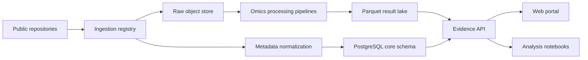

# 肝移植多组学数据库设计草案

## 1. 定位

建议把项目定位为 **LiverTx-OmicsDB：肝移植公开多组学证据库**，核心不是简单堆数据，而是围绕肝移植的关键临床问题，把公开转录组、单细胞、空间/影像、蛋白组、代谢组、微生物组和临床注释统一到可检索、可比较、可再分析的数据库中。

V1 应优先回答四类问题：

1. 移植物状态：无排斥、T cell-mediated rejection, chronic rejection, injury, fibrosis, tolerance。
2. 样本阶段：供肝获取、缺血/再灌注、术后活检、外周血监测。
3. 分子机制：免疫细胞组成、CD8+ tissue-resident memory T cells、IFN-gamma/NF-kB、ECM/fibrosis、代谢功能、药物代谢。
4. 候选标志物：基因、细胞类型、通路、蛋白、代谢物与临床表型的关联证据。

一个重要判断：公开数据里“同一批肝移植患者同时有完整多组学”的数据较少。因此 V1 应设计成 **transplant-centric evidence graph**，先把不同研究、不同组学、不同样本类型统一到同一套实体和证据模型里，而不是强行假装它们都是 matched multi-omics cohort。

## 2. V1 数据范围

### 核心公开数据

| 优先级 | 数据类型 | 代表数据/来源 | 入库价值 |
| --- | --- | --- | --- |
| P0 | bulk transcriptomics | GEO GSE145780，肝移植活检分组包括 normal、TCMR、early injury、fibrosis | 作为排斥/损伤表达特征主数据集 |
| P0 | single-cell RNA-seq | HRA002091、HRA007802；人肝移植拒绝/稳定样本单细胞研究 | 构建细胞类型、TRM T cell、髓系、内皮/胆管细胞证据 |
| P0 | donor liver transcriptomics + pathology | GEO GSE243887，accepted/rejected donor liver RNA-seq + histopathology | 支持供肝可用性、分子质量评估模块 |
| P1 | reference liver immune atlas | human liver-resident immune cell scRNA-seq，包含 liver transplant donor 相关样本 | 作为正常/供体肝免疫背景参考 |
| P1 | blood transcriptomics | GSE200340 等术前/术后血液 RNA-seq | 做非侵入监测和风险预测模块 |
| P1 | proteomics/metabolomics/microbiome | PRIDE、MetaboLights、MGnify 中的肝病、移植、缺血再灌注或免疫抑制相关数据 | 先作为关联证据层，不强求每个队列完整配对 |
| P2 | clinical registry/context | OPTN/SRTR 等公开统计，不纳入个体隐私数据 | 做总体背景、变量词典和外部基准 |

### 外部知识库

| 类型 | 推荐来源 | 用途 |
| --- | --- | --- |
| gene/protein annotation | Ensembl, HGNC, UniProt, Human Protein Atlas | 统一 gene id、蛋白定位和肝组织表达 |
| pathway | Reactome, GO, MSigDB/Hallmark | 通路富集和机制页面 |
| drug/immunosuppression | ChEMBL, DrugBank Open Data where allowed, PharmGKB | tacrolimus、cyclosporine、mycophenolate、steroid 等药物相关基因 |
| disease/phenotype ontology | EFO, MONDO, MeSH | 标准化 rejection、fibrosis、ischemia reperfusion injury 等表型 |
| cell ontology | Cell Ontology, Azimuth/CellTypist labels | 统一单细胞细胞类型 |

## 3. 数据模型

建议采用 PostgreSQL + DuckDB/Parquet + 对象存储三层。

PostgreSQL 存结构化元数据、实体关系和结果索引；Parquet 存表达矩阵、差异分析、细胞级摘要；对象存储存原始文件、处理后 h5ad/rds、QC 图和报告。

### 核心实体

| 实体 | 关键字段 |
| --- | --- |
| study | accession, title, repository, publication, organism, technology, license, access_level |
| biosample | sample_id, study_id, tissue, compartment, timepoint, donor_or_recipient, disease_state, rejection_state |
| subject | public_subject_id, age_bucket, sex, disease_indication, transplant_type, immunosuppression if public |
| assay | assay_id, omics_type, platform, library_strategy, genome_build, processing_pipeline |
| feature | feature_id, feature_type, symbol, ensembl_id, uniprot_id, metabolite_id, pathway_id |
| expression_summary | assay_id, feature_id, group_id, mean, median, pct_detected, log_expression |
| differential_result | contrast_id, feature_id, log2fc, p_value, adj_p_value, method |
| cell_cluster | cluster_id, assay_id, cell_type, cell_ontology_id, marker_genes, n_cells |
| pathway_result | contrast_id, pathway_id, score, p_value, adj_p_value, method |
| evidence | entity_a, relation, entity_b, evidence_type, source_study, score, direction, caveat |

### 关键标准字段

所有样本至少要标准化以下字段：

| 字段 | 建议取值 |
| --- | --- |
| organism | human, mouse, rat |
| sample_origin | graft_liver, donor_liver, recipient_blood, PBMC, serum/plasma, bile, stool |
| transplant_phase | donor_recovery, pre_transplant, reperfusion, early_post_tx, late_post_tx |
| clinical_state | stable, no_rejection, TCMR, AMR_like, chronic_rejection, injury, fibrosis, tolerance |
| assay_modality | bulk_rna, scrna, snrna, spatial, proteomics, metabolomics, microbiome, pathology |
| public_access | open, controlled, metadata_only |

## 4. 数据处理流水线

### 摄入层

1. accession 搜索与登记：GEO/SRA、NGDC GSA-Human、ArrayExpress/BioStudies、PRIDE、MetaboLights、MGnify。
2. 元数据抓取：题名、摘要、样本表、平台、测序类型、publication DOI/PMID。
3. 样本标签标准化：用规则 + 人工审校，把原始描述映射到统一 transplant_phase、sample_origin、clinical_state。
4. 版本化：每次下载记录 accession version、下载时间、文件 checksum、处理 pipeline version。

### 分析层

| 模态 | 推荐处理 |
| --- | --- |
| bulk RNA-seq | nf-core/rnaseq 或直接导入作者 count matrix；DESeq2/edgeR/limma；batch-aware meta-analysis |
| microarray | GEO2R/limma，probe 到 Ensembl gene remap |
| scRNA/snRNA | Scanpy/Seurat，QC、integration、cell type annotation、pseudobulk DE |
| spatial/pathology | 先存 metadata 和图像级派生特征；V1 不重做 whole-slide AI，优先链接公开结果 |
| proteomics | peptide/protein intensity 标准化，gene/protein mapping |
| metabolomics | metabolite id 映射 HMDB/ChEBI/PubChem，通路映射 |
| microbiome | taxon abundance，host phenotype association |

### 质量控制

每个 study 生成一页 QC：

- 样本数量、组别、组织、平台分布。
- batch/source/sex/age 可用性。
- PCA/UMAP 或单细胞 QC 指标。
- 缺失字段报告。
- 是否适合做差异分析、meta-analysis、仅展示或仅做参考。

## 5. Web 功能设计

### 首页即工作台

第一屏不做营销页，直接放可用的查询体验：

- 全局搜索框：gene、cell type、pathway、dataset accession、phenotype。
- 快速筛选：sample origin、clinical state、omics type、organism。
- 三个入口卡片：Dataset Browser、Marker Explorer、Rejection Signature。

### 数据集浏览

用户可以按以下维度筛选：

- tissue: graft liver / donor liver / blood / PBMC / serum / stool
- state: no rejection / TCMR / chronic rejection / injury / fibrosis / tolerance
- modality: bulk RNA / single-cell / proteomics / metabolomics / microbiome
- species: human / mouse / rat

每个数据集页面显示：

- study 摘要、publication、accession、许可和是否受控访问。
- 样本分组和可用元数据。
- 处理状态和 QC。
- 可下载的 normalized matrix、DE results、cell-type summary。

### Gene 页面

例如输入 `CXCL9`：

- 在哪些肝移植队列中与 TCMR 上调相关。
- bulk DE forest plot。
- 单细胞表达分布：T cell、myeloid、endothelial、hepatocyte 等。
- 通路和药物相关注释。
- 证据等级：direct liver transplant evidence / transplant pan-organ evidence / liver disease reference。

### Cell Type 页面

例如 `CD8+ TRM`：

- marker genes。
- 在 rejection vs stable 的比例变化。
- ligand-receptor interactions。
- 代表数据集和 caveat。

### Signature 页面

预置签名：

- TCMR signature。
- IFN-gamma response。
- cytotoxic T/NK。
- macrophage inflammation。
- ECM/fibrosis。
- hepatocyte metabolic function。
- drug metabolism/CYP。

每个签名支持跨数据集打分和可视化。

## 6. API 设计

最小 API：

| Endpoint | 用途 |
| --- | --- |
| `GET /api/studies` | 数据集列表和筛选 |
| `GET /api/studies/{accession}` | 数据集详情 |
| `GET /api/features/{symbol}` | gene/protein/metabolite/pathway 页面 |
| `GET /api/features/{symbol}/evidence` | feature 与 phenotype/cell type 的证据 |
| `GET /api/contrasts` | 可用比较，如 TCMR vs NR |
| `GET /api/contrasts/{id}/de` | 差异分析结果 |
| `GET /api/cell-types/{id}` | 单细胞细胞类型摘要 |
| `GET /api/signatures/{id}/scores` | 签名分数 |
| `POST /api/query` | 高级组合查询 |

## 7. V1 里程碑

### Milestone 1: 数据目录

- 建立 study/biosample/assay schema。
- 摄入 5-10 个肝移植核心 accession。
- 完成样本标签标准化和数据集浏览页面。

### Milestone 2: 转录组证据库

- 处理 GSE145780、GSE243887、GSE200340。
- 做标准 DE、signature scoring、gene page。
- 输出 TCMR、injury、fibrosis、donor suitability 的首批证据表。

### Milestone 3: 单细胞模块

- 摄入 HRA002091/HRA007802 或作者发布的 processed matrix。
- 统一 cell type annotation。
- 支持 gene x cell type x state 查询。

### Milestone 4: 多组学扩展

- 增加 PRIDE/MetaboLights/MGnify 中相关研究的 metadata。
- 先做 feature-level evidence linking，再逐步做真正跨组学联合分析。

## 8. 技术选型

| 层 | 推荐 |
| --- | --- |
| backend | FastAPI |
| database | PostgreSQL + SQLAlchemy/Alembic |
| analytics lake | DuckDB + Parquet |
| workflow | Nextflow 或 Snakemake |
| omics packages | Scanpy, Seurat, DESeq2, limma, gseapy/clusterProfiler |
| frontend | Vue/React + ECharts/Plotly |
| search | PostgreSQL full-text 起步，后续 Meilisearch/OpenSearch |
| deployment | Docker Compose 起步，后续对象存储 + worker queue |

## 9. 风险和边界

1. 公开数据临床标签不统一：必须保留原始标签、标准化标签和人工审校状态。
2. true multi-omics 稀疏：V1 应强调 evidence integration，而不是过早做复杂因果模型。
3. controlled-access human data：只入 metadata 和可公开结果，避免碰隐私原始数据。
4. 跨平台 batch effect：所有跨数据集比较要显示 caveat，不给过度精确的结论。
5. 物种混合：human 与 mouse/rat 分开建模，动物数据只作为机制支持。

## 10. 首批候选公开数据与依据

- GEO GSE145780：GEO 页面描述该系列为 liver transplant biopsies，包含 normal、TCMR、early injury、fibrosis 分组，适合作为 V1 主力排斥 bulk transcriptomics 数据。
- HRA002091/HRA007802：人肝移植单细胞研究报告了 rejection 和 stable/no rejection 相关肝与血样本，可支撑单细胞模块。
- GEO GSE243887：供肝 accepted/rejected RNA-seq + histopathology，适合供肝质量评估方向。
- human liver-resident immune cell atlas：可作为健康/供体肝免疫细胞背景参考。

参考链接：

- GSE145780 GEO: https://www.ncbi.nlm.nih.gov/geo/query/acc.cgi?acc=GSE145780
- Single-cell liver transplant rejection study: https://pubmed.ncbi.nlm.nih.gov/39239518/
- Donor liver transcriptomics/pathology study: https://link.springer.com/article/10.1186/s12864-024-10362-7
- Human liver-resident immune atlas: https://www.nature.com/articles/s41421-020-0157-z
- GEO repository: https://www.ncbi.nlm.nih.gov/geo/
- NGDC GSA-Human: https://ngdc.cncb.ac.cn/gsa-human/
- PRIDE: https://www.ebi.ac.uk/pride/
- MetaboLights: https://www.ebi.ac.uk/metabolights/
- MGnify: https://www.ebi.ac.uk/metagenomics/
